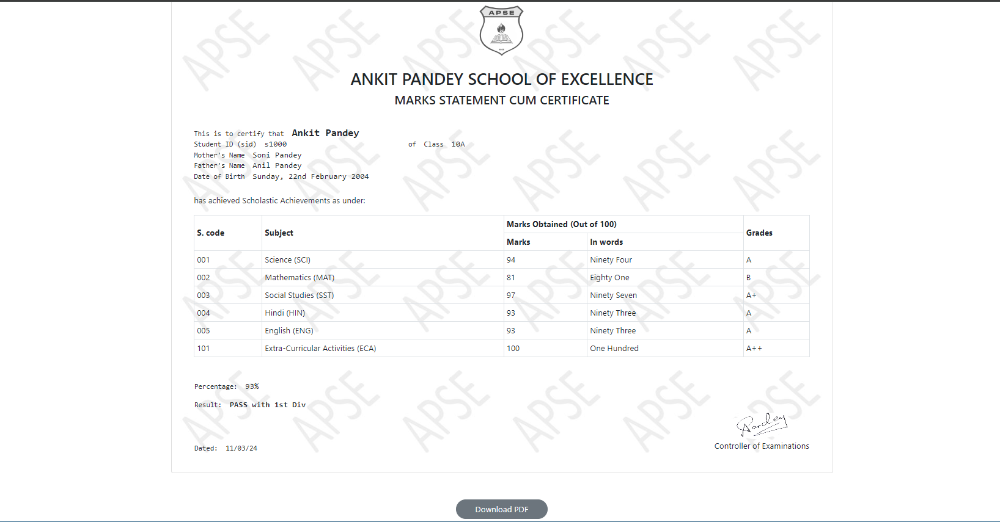
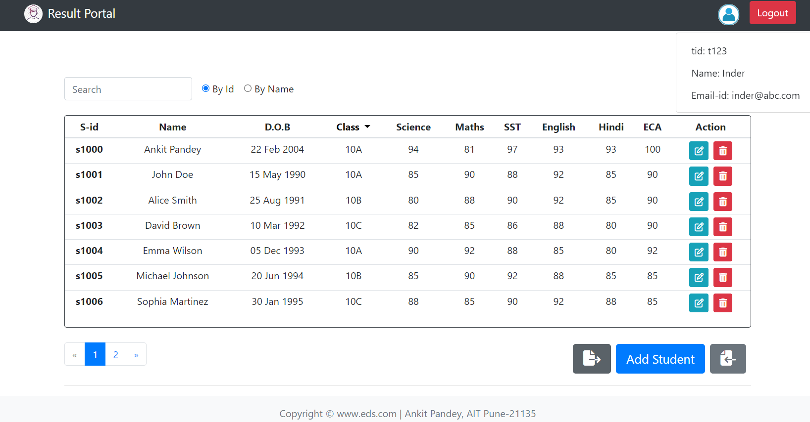
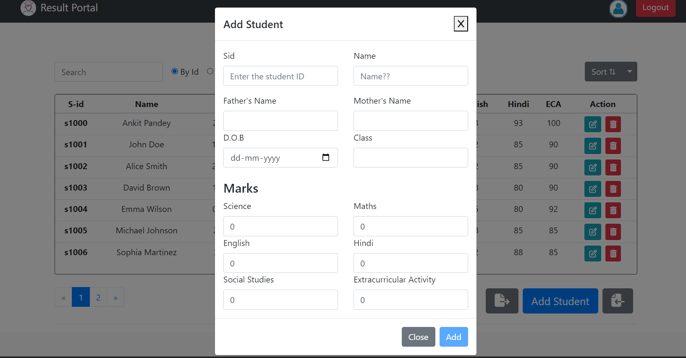

# Student Result Portal

This project implements a Student Result Portal web application designed for managing student records, calculating results, and generating reports. It includes frontend and backend components, with features such as authentication, CRUD operations, and data manipulation.

Technologies Used:

2. `Frontend`: React.js, Bootstrap

2. `Backend`: Node.js, Express.js, MongoDB (Atlas), Mongoose

3. `Authentication`: JSON Web Tokens (JWT), bcrypt.js, express-validator

4. `Data Manipulation`: XLSX.js for Excel import/export

5. `Deployment`: Vercel (frontend), Render (backend), Atlas (database hosting)

The app serves the following functionalities :-

1. `Authentication`: Secure login and token-based authentication using JWT.

2. `Student Management`: CRUD operations for managing student records.

3. `Result`: Automated calculation of student results based on subject scores and `download customized PDF format`.

4. `Export/Import`: Export student data to Excel files and import data from Excel.

5. `Responsive Design`: User-friendly interface designed to work seamlessly on desktop and mobile devices.

Although I learned quite a lot while trying to build this app, but further improvements are yet to be made:-

1. Adding `Phtotos and Media Files` by a user to the ChatRoom.

2. Provision of the `Admin Rights`.

## This is the landing-page for both teachers and student.

## Result page form where you can download the PDF.

## Dashboard loaded with functionalities.

## Clean UI with Modals and no redirect.
